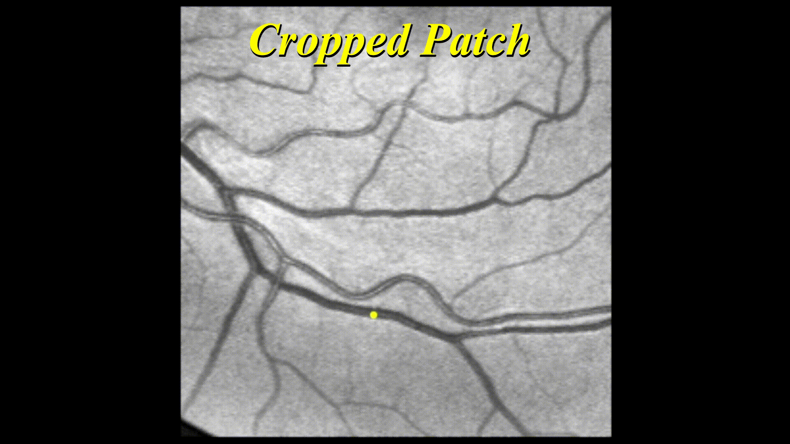
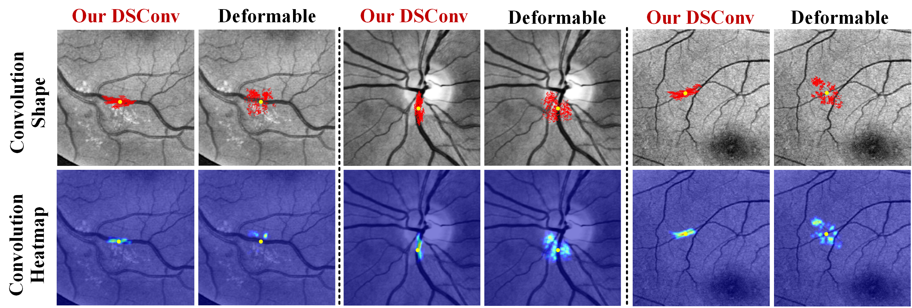
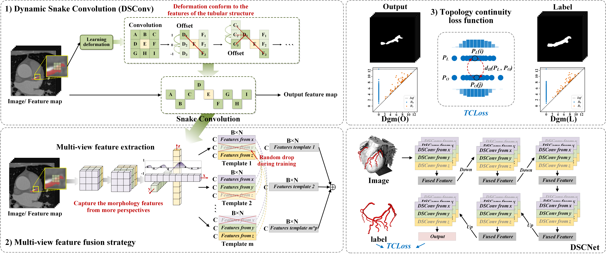
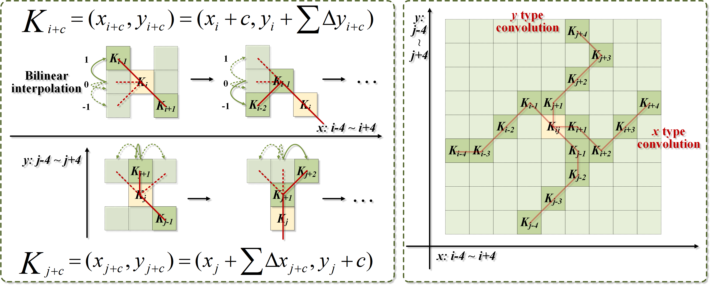

# Dynamic Snake Convolution based on Topological Geometric Constraints for Tubular Structure Segmentation

[](https://yaoleiqi.github.io/pub_homepage/2023_ICCV/index.html) 
[](https://arxiv.org/abs/2307.08388)
[](https://github.com/YaoleiQi/DSCNet)

[Note!]We will soon upload a version for RGB 3-channel images, which will include the segmentation of remote-sensing road images, thank you for your attention!

[NEWS!]We updated a project page to visualize some interesting results!!

[NEWS!]Our 3D version has been open-sourced!! TCLoss will also be online soon!! Thank you very much for waiting!!

[NEWS!]We have updated our interpretation of the paper, and we eagerly invite anyone with questions or topics for discussion to join us in further exploration and conversation!!

[Note!]Others will be gradually and continuously opened!

[NEWS!]This paper has been accepted by **<font color="blue">ICCV 2023</font>**!

[NOTE!!]The code will be gradually and continuously opened!

## NEWS —— We update the visualization results !!

We visualize the whole process of our ***DSConv*** during the complete training process!! (Recorded after every two epochs) The convolution kernel is gradually adapting to the vessel. 

<div align="center"></div>

## Introduction  

### Background

***Tubular structures***, such as blood vessels and roads, hold immense importance in various clinical and natural settings, where precise segmentation is crucial for downstream tasks' accuracy and efficiency. However, this task is far from straightforward, primarily due to the challenges posed by their thin and fragile local structural features, as well as their complex and variable global morphological characteristics.

In our paper, our focus centers on harnessing the elongated and continuous attributes of tubular structures to enhance perception across three key stages of neural networks: **feature extraction**, **feature fusion**, and **loss constraints**. To achieve this, we introduce ***Dynamic Snake Convolution (DSCNet)***, which comprises a multi-view feature fusion strategy and continuity topology-constrained loss. We provide designs for both 2D and 3D-based methods and empirically demonstrate that DSCNet, as proposed in our paper, significantly improves accuracy and continuity in the task of tubular structure segmentation. 

<div align="center"></div>

### Thinking

Before delving into the presentation of our work, it's essential to ponder the value of specialized segmentation methods in the era of  foundation models.

With the advent of advanced models like **SAM (Segment Anything)** [1](https://segment-anything.com/), the **Universal Model** [2](https://arxiv.org/abs/2301.00785), and numerous other robust segmentation foundation models, an increasing number of segmentation tasks yield satisfactory results through direct testing or straightforward fine-tuning using these extensive models. This naturally raises questions about the continued relevance of specialized segmentation work. *<u>Should the next research direction involve creating even larger models</u>*? *<u>Or should we build upon the foundations laid by our predecessors and explore how to fine-tune these large models for specific domains</u>*?

It's important to note that there are still complex domains where foundation models haven't yet provided comprehensive coverage (although it may only be a matter of time). Examples include challenging cases like camouflaged targets, non-prominent targets, and the distinctive tubular structures central to our paper's focus. These structures, in particular, are characterized by their low prevalence, faint and widely dispersed features. Furthermore, when we extend segmentation tasks to 3D or even 4D data, complex structures like blood vessels or airways pose significant challenges to large models. In specific contexts, such as clinical applications, where even a 1% error can be critically dangerous for diagnosis, specialized models remain indispensable.

Hence, the synergy between specialized models and foundation models will drive research to progress faster and achieve better outcomes. Large models emphasize universality, generality, and convenience, upon which specialized models can build by incorporating domain-specific feature information. This collaborative approach enables the attainment of higher accuracy in a more expedited manner.

### Motivation

Drawing inspiration from the concept of Deformable Convolution [3](https://openaccess.thecvf.com/content_ICCV_2017/papers/Dai_Deformable_Convolutional_Networks_ICCV_2017_paper.pdf) ***(I really like this impressive work!)***, our aim is to enable the model to dynamically adapt the shape of its convolution kernel while learning features. This approach allows the model to concentrate on the fundamental structural attributes of tubular formations. However, during our initial experiments, we observed that, due to the relatively small proportion of tubular structures, the model tends to lose its perception of these specific structures. Consequently, the convolution kernel deviates significantly from its intended focus. To address this issue, we propose the design of a specialized network structure tailored to the characteristics of tubular structures. This specialized structure serves as a guiding framework, ensuring that the model prioritizes key features effectively.

<div align="center"></div>


### Method

<div align="center"></div>

### **Dynamic Snake Convolution (DSConv)**

Our objective is to allow the convolutional kernel the **freedom** to adapt to the structure for effective feature learning, while simultaneously ensuring it doesn't stray too far from the target structure within defined constraints. This observation lead us to draw an analogy with the characteristics of an animal: ***snake***. We envisioned the convolution kernel dynamically twisting and contorting like a snake to conform to the target structure, thus enabling more precise feature extraction. 

<div align="center"></div>

Complete freedom in shaping will sometimes result in the loss of fine structural details, which poses a significant challenge in the context of segmenting delicate tubular structures. As depicted in Figure, we drew inspiration from the movement of a snake, which advances **continuously** as its head guides its body, section by section, creating a wave-like motion. 

To address this, we introduced continuity constraints into the design of the convolution kernel. ***At each convolution position, the previous position serves as a reference point for freely choosing the direction of the convolution's movement***. This approach ensures both freedom in adapting to the structure and continuity in feature perception. (Specific formulas can be found in the paper and accompanying code for further details.)

### Experiments

In our paper, we conducted validation using three datasets, consisting of two publicly available datasets and one internal dataset. In the 2D domain, our evaluation involved the **DRIVE** retina dataset and the **Massachusetts Roads dataset**. For 3D evaluation, we utilized a dataset referred to as **Cardiac CCTA data**, which is not publicly available. 

***Additionally, we performed validation on the publicly accessible 3D KIPA22 dataset, and ongoing efforts are focused on testing our method on multiple public challenge datasets***.  

### Summary

Our proposed framework is specifically designed to address the segmentation of elongated tubular structures, effectively integrating morphological features with topological knowledge to guide the model's adaptive segmentation. Nevertheless, it raises an intriguing question of ***whether a similar paradigm can be applied to target other morphological structures*** and potentially enhance performance. Additionally, we are actively exploring further optimizations to make this framework adaptable as a general paradigm within larger models. This would provide a versatile approach for segmenting complex structures with challenging feature identification, extending its utility beyond tubular structures.

## Paper

**Dynamic Snake Convolution based on Topological Geometric Constraints for Tubular Structure Segmentation** [1](https://arxiv.org/abs/2307.08388)  Yaolei Qi, Yuting He, Xiaoming Qi, Yuan Zhang, Guanyu Yang*
Southeast University  
**IEEE/CVF Conference on International Conference on Computer Vision 2023** 

## Model - Introduction of our code!

> **Abstract:**
>
> The folder contains a total of nine code files beginning with S0 to S3, which represent steps 0 to 3. 

### S0_Main

```python
"""
This code contains all the "Parameters" for the entire project -- <DSCNet>
Code Introduction: (The easiest way to run a code!)
    !!! You just need to change lines with "# todo" to get straight to run
    !!! Our code is encapsulated, but it also provides some test interfaces for debugging
    !!! If you want to change the dataset, you can change "DRIVE" to other task name
"""
# Change the todo content and than run ...
> python S0_Main.py
```

### S3_DSConv

$$
\begin{equation}
K_{i\pm c}=\left\{
    \begin{aligned}
    (x_{i+c}, y_{i+c}) = (x_i+c, y_i + \Sigma_{i}^{i+c} \Delta y), \\
    (x_{i-c}, y_{i-c}) = (x_i-c, y_i + \Sigma_{i-c}^{i} \Delta y), \\
    \end{aligned}
    \right. 
\end{equation}
$$

```python
for index in range(1, center):
y_offset_new[center + index] = (y_offset_new[center + index - 1] + y_offset[center + index])
y_offset_new[center - index] = (y_offset_new[center - index + 1] + y_offset[center - index])
```

$$
\begin{equation}
K_{j\pm c}=\left\{
    \begin{aligned}
    (x_{j+c}, y_{j+c}) = (x_{j} + \Sigma_{j}^{j+c} \Delta x, y_j+c), \\
    (x_{j-c}, y_{j-c}) = (x_{j} + \Sigma_{j-c}^{j} \Delta x, y_j-c), \\
    \end{aligned}
    \right. 
\end{equation}
$$

```python
for index in range(1, center):
x_offset_new[center + index] = (x_offset_new[center + index - 1] + x_offset[center + index])
x_offset_new[center - index] = (x_offset_new[center - index + 1] + x_offset[center - index])
```


## Citation
> @InProceedings{Qi_2023_ICCV,
    author    = {Qi, Yaolei and He, Yuting and Qi, Xiaoming and Zhang, Yuan and Yang, Guanyu},
    title     = {Dynamic Snake Convolution Based on Topological Geometric Constraints for Tubular Structure Segmentation},
    booktitle = {Proceedings of the IEEE/CVF International Conference on Computer Vision (ICCV)},
    month     = {October},
    year      = {2023},
    pages     = {6070-6079}
}
